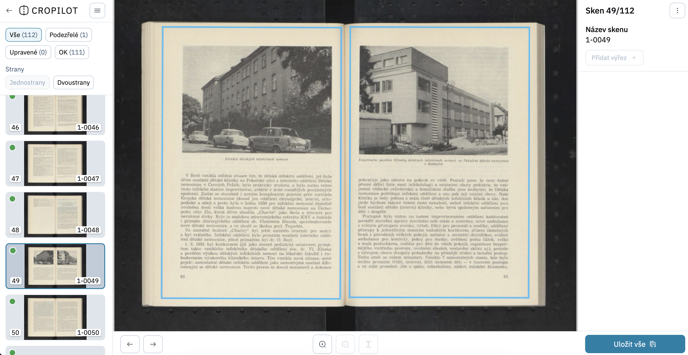
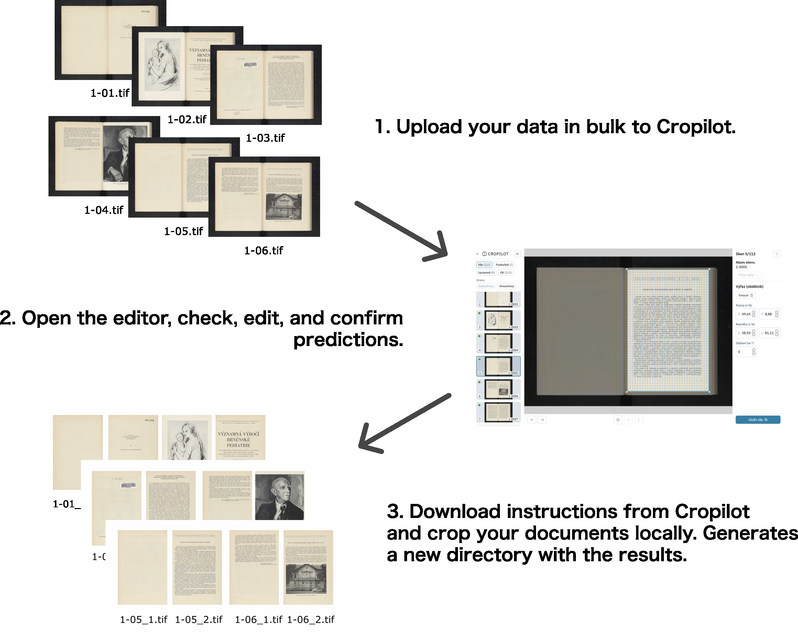

# Cropilot

Cropilot is an AI-powered tool for automatically cropping scanned documents.

It provides a web application and backend service that detect document page boundaries, correct orientation, and generate crop instructions for uploaded scans. Cropilot is designed to simplify the processing of large batches of scanned documents by using machine learning models to identify page coordinates and apply rotation correction when needed.



## Overview

Cropilot combines a FastAPI backend, asynchronous task processing, MongoDB storage, and fine-tuned computer vision models. Uploaded images are processed through a machine learning pipeline that detects page boundaries, determines whether rotation correction is required, and stores the resulting crop metadata.

The backend exposes an API used by the Cropilot frontend and can also be accessed through the separate Cropilot Tools repository.

## Self-hosting

If you want to self-host, the app can be deployed using Docker Compose or Helm for Kubernetes deployment. The production setup includes the backend API, worker, Hatchet queue manager, MongoDB, and frontend services. Cropilot releases are also published as Docker images on Docker Hub under names [trinera/smart-crop](https://hub.docker.com/repository/docker/trinera/smart-crop) and [trinera/cropilot-frontend](https://hub.docker.com/repository/docker/trinera/cropilot-frontend). 

See the [Docker Deployment Guide](./deploy/docker/README.md) or [Kubernetes Deployment Guide](./deploy/kubernetes/README.md) for full setup instructions.


## Cropilot Tools

Cropilot Tools is a separate repository containing utility scripts for working with the Cropilot API.

These tools can be used to:

- Upload scan batches to Cropilot editor.
- Crop images using Cropilot-generated instructions.
- Fine-tune custom models for your own document datasets.



*Example of bulk image processing workflow using the uploader.py script*

See the [Cropilot Tools Guide](https://github.com/moravianlibrary/cropilot-utils/tree/main/cropilot_api_tools) for usage instructions.

## Development

### Aplication structure

The application is organized into the following modules:

- **api**: FastAPI routers used by the frontend and external integrations.
- **core**: AI models and image-processing logic, including a fine-tuned YOLO model for page coordinate detection and a ResNet-based rotation model for orientation correction.
- **db**: MongoDB collections defined with Pydantic models, together with related database queries.
- **tasks**: Hatchet task queue configuration and worker tasks that execute the machine learning pipeline asynchronously.

### Cheat sheet

```bash
uvx ruff format . && uvx ruff check --fix .
```

Format the project and fix linter errors.

```bash
uv run pytest -v
```

Run tests.